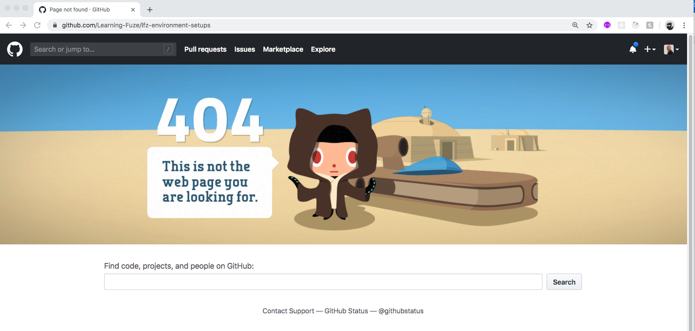
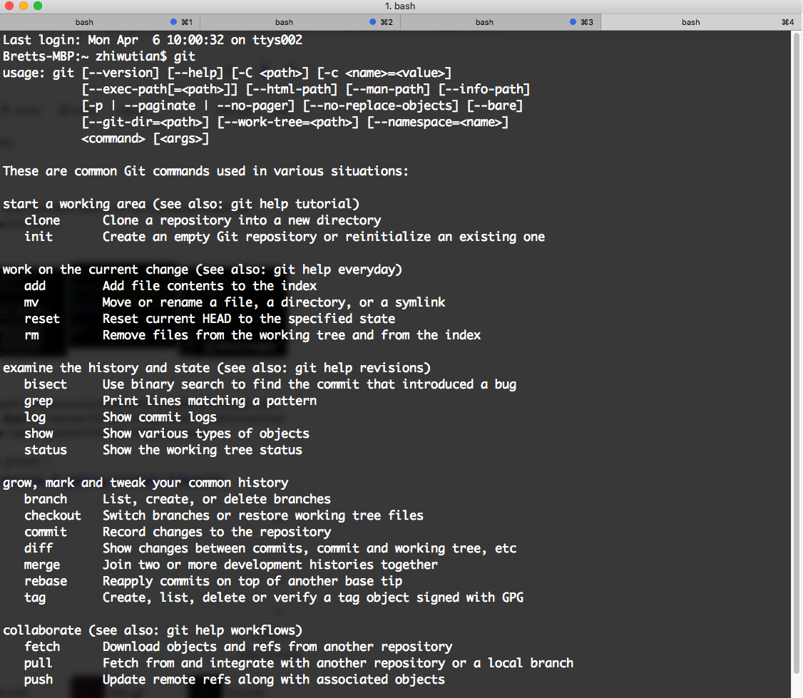
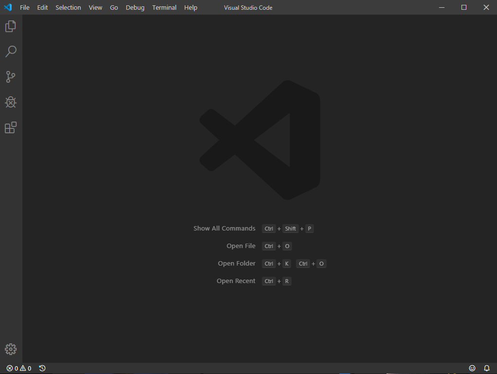
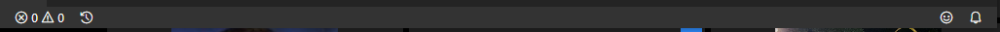

# lfz-environment-setup

## Windows

## Prep Class

The following is a step by step guide to setting up the LearningFuze coding environment, which you will be using for all LearningFuze-related exercises, challenges, and coding activities.

If you experience any issues during the setup process, please reach out in the proper `question queue` Slack channel for your course to receive instructor assistance. We are here to help!!!

1. Submit your Github name in the primary Slack channel for your class. **THIS STEP IS MANDATORY TO BE ABLE TO CONTINUE THE SETUP PROCESS**

1. Download and install the Google `Chrome` browser if you do not already have it installed.
    - The LearningFuze programs use the `Chrome` browser exclusively.
    - Install link: https://www.google.com/chrome/?brand=CHBD&gclid=EAIaIQobChMIkfDJ9pei6AIVpBitBh0F5gqFEAAYASAAEgIAkvD_BwE&gclsrc=aw.ds
1. Download and install the `Zoom` Desktop client.
    - Zoom will be used for all remote classes and all remote student help.
    - Install link: https://zoom.us/download
1. When the above installation is confirmed, it is time to install the `Slack` app.
    - The desktop/laptop application is required for all `LearningFuze` programs as it is much easier to miss notifications when using the web application.
    - Installation downloads link: https://slack.com/downloads/
    - After installation is complete, make sure to open the application and log in to confirm you are in the proper `LearningFuze` workspace.
1. Using the instructions located in the `lfz-code` repository, install `VS code` and `git`.
    - Installation instructions: https://github.com/Learning-Fuze/lfz-code#macos-instructions

    - **NOTE:** The LearningFuze programs use a specially configured version of `VS code`. If you already have `VS Code` installed on your system, and you did not get it from us, you will **need** to delete it during the setup process.
        - Note: Installation instructions are available for both automatic and manual installation .
        - If you are unable to complete automatic installation, please install using the manual instructions.
        - **NOTE:** If you see the example screen below when following the above instructions link, there are two possible reasons:
            - You are not logged in to `Github`
                - Logging in will fix this
            - You have not been added to the `Github` team.
                - Give your `Github` name to an instructor so you can be added to the team.
        - Example output:
        
1. When the above installation, either manual or automatic is complete, you must confirm that `git` was installed correctly.
    - On `Mac`, open the `Terminal` application, and type `git` into the command line and press `enter`.
    - If `Git` has been properly installed you should see the following output in the command line window:
        - Example output:
        

    - What you are seeing is a list of `Git` commands, this means installation is complete.
    - If you do not see the above output, contact an instructor for assistance!!
1. Once you have confirmed `Git` is installed, it is time to configure `Git` with your name and email so that it can correctly track and manage the code you will be working on in this and other LearningFuze programs.
    - Watch the video below on configuring `Git`:
    - Git config video: https://youtu.be/kdwH4680WuA

1. When you have configured `Git` with your username and email, it is time to confirm that `VS Code` is installed correctly.
    - Open `VS Code` and confirm that the bar on the bottom of your window is black:
        - Example `VS Code` screen:
        
        - Example of black bar:
        
    - If the bar is not black, contact an instructor so that they can assist you with getting the proper build of `VS Code`.

1. When the above confirmation is complete, it is time to `fork` the `Github` repository which contains all of the exercises and resources for the class.
    - Link for LFZ Prep lessons repo: https://github.com/Learning-Fuze/lfz-prep-lessons
    - Watch the video below on forking a repository:
        - Forking Video: https://youtu.be/pRhr2Ia6i70

1. When the repository has been correctly forked, it is time to create the `lfz` folder which will hold the repository for this class.
    - Watch the video on creating the `lfz` folder: https://youtu.be/39qZ0oGc1a4
1. When you have successfully created the `lfz` folder, it is time to clone down the GitHub repository that you forked in step 9 to your `lfz` folder and create your first git branch.
    - Watch the video on cloning down the forked repo and creating git branches: https://youtu.be/rmh9DpuUeCY
1. When you have been able to successfully clone down the `LFZ-Prep` repository, it is time to add the `upstream` url which will be used to update your forked version of the repository during the `Prep Class` as needed.
    - Watch the video on adding the correct `upstream` url: https://youtu.be/VNGj9jJpexo
1. When the repository has been properly cloned, it is time to use `VS Code` to open the files of the repository and to create a new folder and a new `index.html` file which will hold some example `HTML` code.
    - Watch the video on using `VS Code` to open repositories and create new files and folders: https://youtu.be/UjFYiByVtiM
1. When you have been able to create your `index.html` file and open it correctly in the browser, it is time to use `Git` to save your file changes to the example branch and push that branch to Github so you can make a pull request to have your code checked by an instructor.
    - Watch the video on using `Git` to push your code to Github: https://youtu.be/n6MmLhWMSuw

1. When you have completed adding, committing, and pushing your branch to Github, it is time to create your pull request.
    - Watch the video on creating a pull request on Github: https://youtu.be/BmEU47GRcYo
1. When the pull request has been made and you have posted it in the correct `pull-requests` channel, congratulations!!! your setup process is completed. Please let your instructor know that you have completed the process, and get ready to become the coder you have been dreaming of!!!
